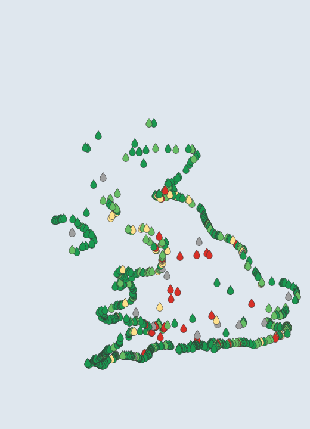
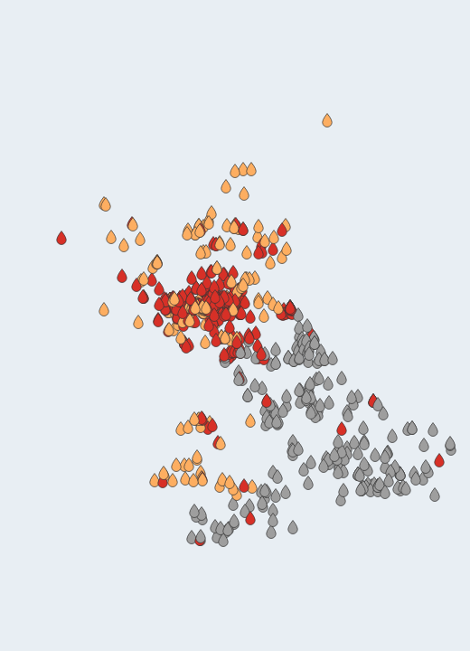

# Outfall UK

**Is it safe to swim?** Outfall UK brings the UK's bathing-water and sewage-spill
data into QGIS in two layers:

1. **Bathing waters** — every designated bathing water in **England, Wales,
   Scotland and Northern Ireland**, coloured by its official water-quality rating.
2. **Live storm overflows** — the sewage overflows **discharging right now** (or
   recently), near-real-time from every English and Welsh water company plus
   Scottish Water.

So you can see the state of the whole coast (and inland bathing waters) at a
glance, and click any site or overflow for detail.

It is built on the same engine as a family of live-tracking QGIS plugins — a
pluggable data-source layer, a merged map layer, categorised rendering and
identify — but where those stream moving things, Outfall UK monitors places:

- [Wake](https://github.com/PeterCotroneo/Wake) — marine vessels (AIS)
- [Contrail](https://github.com/PeterCotroneo/Contrail) — aircraft (ADS-B)
- [Zenith](https://github.com/PeterCotroneo/Zenith) — satellites (SGP4)
- [SeaState US](https://github.com/PeterCotroneo/SeaState-US) — NOAA tides & buoys

*Bathing waters coloured by annual rating, and the full storm-overflow network coloured by state — red discharging now, orange recently discharged, green not discharging, grey offline / no data.*

## Features

- **Whole-UK coverage** — ~700 designated bathing waters across all four nations, from one panel.
- **Live sewage spills** — a second layer showing **every monitored storm overflow** (~20,000) coloured by state — **discharging now** (red), **recently discharged**, last 48h (orange), **not discharging** (green), **offline** (grey) or **no data** (dark grey) — near-real-time (within about an hour) from all English and Welsh water companies and Scottish Water, the same feeds behind the [National Storm Overflow Hub](https://www.streamwaterdata.co.uk/pages/the-national-storm-overflow-hub). A per-state filter shows or hides each state, like the Surfers Against Sewage Live Sewage Map.
- **Free and keyless** — official open data, no account or API key.
- **Colour by rating or risk** — switch bathing waters between the **annual classification** (Excellent, Good, Sufficient, Poor) and, where published, **today's short-term pollution-risk forecast** (normal vs increased risk).
- **Toggle nations** — show or hide England, Wales, Scotland and Northern Ireland independently.
- **Click for detail** — Identify any site for its rating, latest risk, operator and profile link; identify any overflow for its status, company and receiving watercourse.
- **Refreshes** — reloads on demand and every half hour, so live spill status and in-season risk forecasts stay current.

## Data sources

All data comes straight from the four national regulators, under the
[Open Government Licence](https://www.nationalarchives.gov.uk/doc/open-government-licence/version/3/):

| Nation | Regulator | Source |
|---|---|---|
| England | Environment Agency | DEFRA data-services platform (`environment.data.gov.uk`) |
| Wales | Natural Resources Wales | DEFRA data-services platform (`environment.data.gov.uk/wales`) |
| Scotland | Scottish Environment Protection Agency (SEPA) | SEPA open ArcGIS map server (`map.sepa.org.uk`) |
| Northern Ireland | Dept. of Agriculture, Environment & Rural Affairs (DAERA) | DAERA open ArcGIS feature service |

Short-term daily **pollution-risk forecasts** are published for England and Wales
during the bathing season; Scotland and Northern Ireland sites show their annual
classification only. Ratings are the official classifications calculated from up
to four years of monitoring; they are not a live measurement of the water in
front of you. Always check on-site signage before bathing.

### Live storm overflows

The **live storm overflows** layer draws near-real-time Event Duration Monitoring
(EDM) data from the water companies' open ArcGIS "Stream" feeds — the same data
behind Water UK's National Storm Overflow Hub:

| Companies | Coverage | Live status? |
|---|---|---|
| Anglian, Northumbrian, Severn Trent, Southern, Thames, United Utilities, Wessex, Yorkshire, South West | England | Yes |
| Welsh Water (Dŵr Cymru) | Wales | Yes |
| Scottish Water | Scotland | Yes |
| NI Water | Northern Ireland | No — locations shown as "No Data" |

Companies aim to report a spill within about an hour of an overflow starting.
This is near-real-time operational data that has **not** been through the
Environment Agency's regulatory audit; treat it as indicative. Northern Ireland
(NI Water) is the only UK utility that does not publish live discharge status, so
its storm overflows appear as **No Data** — their locations only. The layer shows every monitored outfall coloured by
its current state; use the per-state filter to focus on, say, only those
discharging now.

## Install

1. Clone this repository (or use **Code → Download ZIP** on GitHub).
2. Zip the inner **`outfall/`** folder, so the archive contains `outfall/` at its top level — or copy `outfall/` straight into your QGIS plugins directory.
3. In QGIS: **Plugins → Manage and Install Plugins → Install from ZIP**, and select that zip.
4. Enable **Outfall UK**. An **Outfall UK** panel appears on the right, and the bathing waters load automatically.

## Usage

1. Open the **Outfall UK** panel — every UK bathing water loads onto the map.
2. Use **Colour by** to switch between the annual rating and today's pollution risk.
3. Tick or untick a **nation** to show or hide it.
4. Tick **Show storm overflows** to add the live storm-overflow layer (~20,000 outfalls); use the per-state checkboxes to show or hide Discharging, Recently discharged, Not discharging, Offline and No Data.
5. **Click** a site or overflow to see its detail — bathing waters show rating, risk, operator and profile link; overflows show status, company and receiving watercourse.

## Credits

Contains public sector information from the Environment Agency, Natural Resources
Wales, the Scottish Environment Protection Agency and the Department of
Agriculture, Environment and Rural Affairs, licensed under the Open Government
Licence v3.0. Storm-overflow data © the respective water companies (Anglian,
Northumbrian, Severn Trent, Southern, Thames, United Utilities, Wessex, Yorkshire,
South West, Welsh Water and Scottish Water), published via the Water UK Stream
programme. Northern Ireland storm-overflow locations © NI Water / DAERA.

## License

GPL-2.0-or-later.
